# EigenLayer x Ava Integration Architecture

## Complete System Architecture

## Detailed Flow Diagram

## Component Interaction Diagram

## Data Flow Architecture

## Security Model

## Key Features Visualization

```mermaid
mindmap
  root((Ava + EigenLayer))
    Current AVS
      Portfolio Validation
      Operator Network
      On-chain Records
      3 Validation Types
    EigenCompute
      Verifiable AI
      Cryptographic Proofs
      Multi-validator Consensus
      Model Registry
    EigenVerify
      Dispute Resolution
      Subjective Judgments
      Slashing Mechanism
      Evidence-based
    EigenDA
      Complete History
      Time-travel Debug
      High Redundancy
      Audit Trails
    Benefits
      Trust → Verify
      Transparency
      User Protection
      Regulatory Ready
```

## Implementation Status

This comprehensive architecture shows:

1. **System Overview**: How all components interact
2. **Detailed Flow**: Step-by-step process from user input to execution
3. **Component Interaction**: Trust model transformation
4. **Data Flow**: How information moves through the system
5. **Security Model**: Cryptoeconomic incentives and slashing
6. **Feature Map**: All capabilities in one view
7. **Implementation Timeline**: Current status and roadmap

The diagrams clearly illustrate how EigenLayer transforms Ava from a trusted system to a trustless, verifiable platform where every decision can be mathematically proven and disputed if necessary.