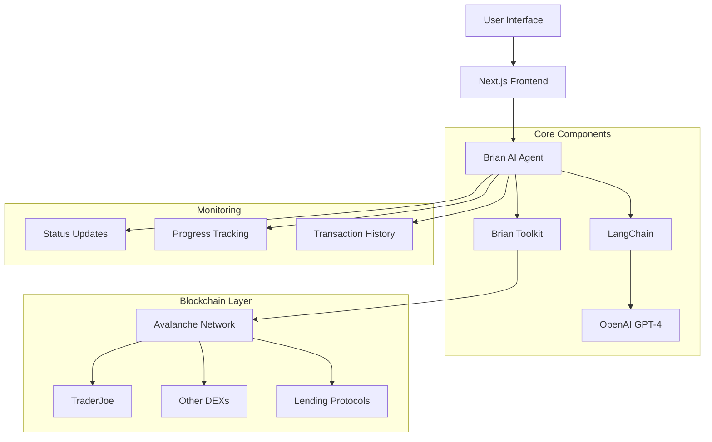

# 🤖 Ava the Portfolio Manager AI Agent


> Group of Multiple specialized autonomous AI agents with powerful tools that work together in collaberation to analyze, recommend, and execute optimal DeFi strategies while maintaining user-defined risk parameters and portfolio goals currently live on Avalanche , Mode , Base, powered by Brian AI and LangChain

- risk parameters and portfolio balance
- Provides real-time feedback and execution status

## 🎯 Problem Statement
Managing DeFi portfolios across multiple protocols on Avalanche can be complex and time-consuming. 

Users need to:
- Monitor multiple positions across different protocols
- Execute complex multi-step transactions
- Stay updated with the latest crosschain yield opportunities
- Maintain desired portfolio allocations
- React quickly to market changes

## 💡 Solution
An autonomous AI agent that manages your Avalanche DeFi portfolio by:
- Understanding high-level goals in natural language
- Breaking down complex operations into executable steps
- Automatically executing transactions when needed
- Providing real-time updates and progress tracking
- Maintaining portfolio balance according to user preferences

## 🏗 Architecture


## 🌟 Key Features

### 1. Natural Language Interface
- Express portfolio goals in plain English
- No need to understand complex DeFi terminology
- AI translates intentions into actions

### 2. Autonomous Execution
- Breaks down complex goals into steps
- Executes transactions automatically
- Handles error recovery
- Provides progress updates

### 3. Portfolio Management
- Multi-protocol position monitoring
- Yield optimization
- Risk management
- Rebalancing capabilities

### 4. Real-time Updates
- Live execution status
- Progress tracking
- Transaction confirmations
- Performance metrics


This integration enables:

- Workflow Orchestration: Agents can now trigger and monitor complex multi-step operations through Kestra workflows.
- Error Handling: Built-in retry mechanisms and error handling through Kestra's execution engine
- Monitoring: Track execution status and progress of complex operations
- Scalability: Leverage Kestra's distributed execution capabilities for resource-intensive tasks.

The agents can now handle complex operations like portfolio rebalancing by:

- Breaking down operations into discrete tasks
- Executing them in the correct order
- Handling failures and retries
- Providing real-time status updates

This makes the agents more robust and capable of handling complex DeFi operations in a reliable, monitored way.


## 🔗 AVS & Subgraph Integration

### Eigenlayer AVS Integration

The portfolio manager integrates with Eigenlayer's Actively Validated Service (AVS) to provide decentralized portfolio validation:

#### Components:

1. **PortfolioValidationServiceManager**
   - Manages portfolio validation tasks
   - Handles operator registrations and responses
   - Validates operator signatures
   - Maintains token registry and eligibility data

2. **PortfolioTask**
   - Defines portfolio validation task structure
   - Tracks task status and responses
   - Supports multiple validation strategies:
     - TokenEligibility
     - PortfolioBalance
     - RiskAssessment

#### Deployment & Setup:

- **PortfolioDeployer**
  - Deploys and initializes AVS contracts
  - Sets up stake registry
  - Configures operator quorum
  - Manages token strategy deployment

- **Deployment Library**
  - Handles proxy deployment
  - Manages contract upgrades
  - Stores deployment configurations

### Subgraph Integration

The subgraph indexes and tracks portfolio validation events and data:

#### Schema:

```graphql
type Portfolio @entity {
  id: Bytes!
  taskId: BigInt!
  tokens: [Token!]!
  amounts: [BigInt!]!
  strategy: String!
  validationType: Int!
  status: Int!
  createdAt: BigInt!
  validations: [Validation!]!
}

type Token @entity {
  id: Bytes!
  chain: String!
  address: Bytes!
  isEligible: Boolean!
  metadata: String
  createdBlock: BigInt!
  portfolios: [Portfolio!]!
}

type Validation @entity {
  id: Bytes!
  portfolio: Portfolio!
  operator: Bytes!
  validation: Bytes!
  timestamp: BigInt!
}
```

#### Event Handlers:

- **NewPortfolioTask**: Indexes new portfolio validation requests
- **ValidationSubmitted**: Tracks operator validations
- **TokenDataUpdated**: Monitors token eligibility updates

### Integration Flow

1. **Portfolio Creation**
   - User submits portfolio through Ava
   - AVS creates validation task
   - Event emitted and indexed by subgraph

2. **Validation Process**
   - Operators submit validations
   - AVS verifies signatures
   - Subgraph indexes validation responses

3. **Data Analysis**
   - Ava queries subgraph for validation data
   - AI analyzes validation responses
   - Generates recommendations based on consensus

4. **Token Management**
   - AVS maintains token registry
   - Updates token eligibility
   - Subgraph provides token analytics

### Benefits

- **Decentralized Validation**: Multiple operators validate portfolio decisions
- **Transparent History**: All validations and updates are publicly trackable
- **Real-time Analytics**: Quick access to historical validation data
- **Scalable Architecture**: Handles multiple portfolios and validation strategies
- **Secure Operations**: Cryptographic verification of operator responses

## 🛠 Technology Stack
- **Frontend**: Next.js, TypeScript, TailwindCSS
- **AI Engine**: Brian AI, LangChain, GPT-4
- **Blockchain**: Avalanche C-Chain, Teleporter, Eigenlayer AVS
- **Development**: Foundry, Avalanche CLI
- **Indexing**: The Graph Protocol

## 📋 Example Use Cases

I'll update the Example Use Cases section in the README.md based on the example scenarios from page.tsx:

```markdown
## 📋 Example Use Cases

### 1. Portfolio Optimization
```text
User: "I have 10 AVAX and want to optimize my portfolio between lending, liquidity provision, and trading. What's the best strategy right now?"

Agent Collaboration Flow:
1. Portfolio Manager analyzes request and current market conditions
2. DeFi Analytics Agent provides real-time data:
   - Aave AVAX lending APY: 1.77%
   - Uniswap AVAX-USDC pool APR: 43.893%
   - Curve Blizz pool APY: 1.58%
   - DeFi TVL trend: +5% weekly
3. Trading Agent evaluates market opportunities
4. Liquidity Agent assesses pool stability
5. Portfolio Manager provides final allocation strategy
```

### 2. Risk-Managed Yield Farming
```text
User: "Find me the highest yield opportunities while maintaining moderate risk levels"

Agent Collaboration Flow:
1. Portfolio Manager evaluates risk parameters
2. DeFi Analytics Agent scans protocols:
   - Protocol TVL analysis
   - Smart contract audit status
   - Historical yield stability
3. Risk Assessment Agent performs:
   - Protocol risk scoring
   - Impermanent loss calculation
   - Market volatility analysis
4. Final recommendation with risk-adjusted returns
```

### 3. Multi-Protocol Optimization
```text
User: "Distribute 5000 USDC across lending platforms for the best risk-adjusted returns"

Agent Collaboration Flow:
1. DeFi Analytics Agent scans lending markets:
   - Protocol-specific APYs
   - Total deposits
   - Utilization rates
2. Risk Agent evaluates:
   - Protocol security
   - Market conditions
   - Collateral factors
3. Portfolio Manager executes:
   - Optimal distribution
   - Position monitoring
   - Auto-rebalancing setup
```

### 4. Smart Rebalancing
```text
User: "Monitor and rebalance my portfolio to maintain 40% AVAX, 30% ETH, 30% stables"

Agent Collaboration Flow:
1. Portfolio Manager tracks allocations
2. Trading Agent monitors:
   - Price movements
   - Trading volumes
   - Market depth
3. DeFi Analytics provides:
   - Gas optimization data
   - Slippage estimates
   - Best execution routes
4. Automated rebalancing when:
   - Deviation exceeds 5%
   - Gas costs are optimal
   - Market conditions favorable


### 5. Yield Optimization
```text
User: "Optimize my stablecoin yields while maintaining 50% USDC and 50% USDT split"

Agent will:
1. Analyze current positions
2. Scout highest yield opportunities
3. Execute necessary swaps
4. Deploy to optimal protocols
5. Monitor and rebalance as needed
```

### 6. Portfolio Rebalancing
```text
User: "Rebalance my portfolio to 30% ETH, 30% AVAX, and 40% stables"

Agent will:
1. Calculate required trades
2. Find optimal execution paths
3. Execute trades in optimal order
4. Confirm final allocations
5. Report completion
```

### 7. Cross-Chain Management
```text
User: "Bridge 1000 USDC from Ethereum to Avalanche and deploy to highest yield"

Agent will:
1. Initiate bridge transaction
2. Monitor bridge status
3. Receive funds on Avalanche
4. Research yield opportunities
5. Deploy to best protocol
```

### 8. Starknet Portfolio Management
```text
User: "Deploy and manage my meme token portfolio on Starknet with unruggable features"

Agent Collaboration Flow:
1. Portfolio Manager analyzes Starknet opportunities:
   - Unruggable meme token protocols
   - Cairo-based DeFi platforms
   - Cross-L2 bridges (Starkgate)

2. DeFi Analytics Agent provides Starknet data:
   - Jediswap liquidity pools
   - Ekubo AMM metrics
   - zkLend lending rates
   - Cross-L2 bridge volumes

3. Risk Assessment Agent evaluates:
   - Smart contract security (Cairo 1.0)
   - Protocol TVL stability
   - Bridge security
   - Token distribution metrics

4. Execution Flow:
   - Deploy using Starknet.js/Starknet React
   - Integrate with Argent X/Braavos wallet
   - Monitor via Starkscan/Voyager
   - Auto-rebalance using Cairo contracts

Key Features:
- Cairo 1.0 smart contract integration
- STARK-proof based security
- Cross-L2 bridging optimization
- Unruggable token standards compliance
- Real-time Starknet block monitoring

Example Implementation:
```cairo
#[starknet::contract]
mod PortfolioManager {
    use starknet::ContractAddress;
    use array::ArrayTrait;
    
    #[storage]
    struct Storage {
        portfolio_tokens: LegacyMap::<ContractAddress, u256>,
        risk_parameters: LegacyMap::<ContractAddress, u256>,
        total_value: u256,
    }

    #[external(v0)]
    fn add_to_portfolio(
        ref self: ContractState,
        token: ContractAddress,
        amount: u256
    ) {
        // Verify token is unruggable
        assert(self.is_unruggable(token), 'Token must be unruggable');
        
        // Update portfolio
        self.portfolio_tokens.write(token, amount);
        self.update_total_value();
    }

    #[view]
    fn get_portfolio_stats(self: @ContractState) -> (u256, u256) {
        (self.total_value.read(), self.risk_score.read())
    }
}
```

Integration with Unruggable Standards:
- Implements ERC-20 with additional safety features
- Automated liquidity management
- Token vesting mechanisms
- DAO-governed parameters
- STARK-verified operations

Benefits:
1. Provable security through STARK proofs
2. Gas optimization via Cairo VM
3. Cross-L2 interoperability
4. Transparent on-chain analytics
5. Automated risk management
```

This example showcases how the AI agent can:
- Deploy and manage portfolios on Starknet
- Integrate with unruggable token standards
- Monitor cross-L2 opportunities
- Execute STARK-verified transactions
- Maintain optimal risk parameters

The integration leverages key Starknet infrastructure:
- Cairo 1.0 for smart contracts
- Starknet.js for interactions
- Argent X/Braavos for wallet management
- Starkscan/Voyager for monitoring
- Starkgate for bridging assets

Resources:
- [Awesome Starknet](https://github.com/keep-starknet-strange/awesome-starknet)
- [Unruggable Meme Standard](https://github.com/keep-starknet-strange/unruggable.meme)
- [Cairo Book](https://book.cairo-lang.org/)
- [Starknet Documentation](https://docs.starknet.io/)

## 🚀 Getting Started

1. Clone the repository
```bash
git clone https://github.com/kamalbuilds/ava-portfolio-manager-ai-agent
```

2. Install dependencies
```bash
cd frontend
npm install
```

3. Set up environment variables
```env
NEXT_PUBLIC_BRIAN_API_KEY=your_brian_api_key
NEXT_PUBLIC_PRIVATE_KEY=your_private_key
NEXT_PUBLIC_OPENAI_API_KEY=your_openai_api_key
```

4. Run the development server
```bash
npm run dev
```

## 📄 License
MIT

## 🤝 Contributing
Contributions are welcome! Please read our contributing guidelines before submitting PRs.
```
## ⭐ Key Features

### 🧠 Intelligent Portfolio Management
- Natural language interaction
- Autonomous strategy execution
- Real-time portfolio analysis
- Risk-aware decision making
- Multi-protocol optimization

### 💼 Portfolio Operations
- Token swaps
- Liquidity provision
- Yield farming
- Risk rebalancing
- Position management

### 📊 Monitoring & Feedback
- Real-time execution status
- Progress tracking
- Transaction confirmations
- Performance metrics
- Risk alerts

## 🏗️ Architecture



## 🛠️ Built With

- **Frontend**: Next.js, TypeScript, TailwindCSS
- **AI/ML**: Brian AI, LangChain, GPT-4
- **Blockchain**: Avalanche Network, TraderJoe DEX
- **Development**: Node.js, Ethers.js

## 📋 Prerequisites

```bash
# Required environment variables
NEXT_PUBLIC_BRIAN_API_KEY=your_brian_api_key
NEXT_PUBLIC_PRIVATE_KEY=your_private_key
NEXT_PUBLIC_OPENAI_API_KEY=your_openai_api_key
```

## 💡 Example Use Cases

### 1. Yield Optimization
```plaintext
User: "Optimize my portfolio for maximum yield while maintaining 30% in stablecoins"

Agent will:
1. Analyze current holdings
2. Identify highest yield opportunities
3. Calculate optimal allocations
4. Execute required swaps
5. Deploy capital to yield protocols
6. Maintain stability ratio
```

### 2. Risk Management
```plaintext
User: "Reduce portfolio risk and move to defensive positions"

Agent will:
1. Evaluate current risk metrics
2. Identify high-risk positions
3. Plan exit strategies
4. Execute position closures
5. Reallocate to stable assets
6. Confirm risk reduction
```

### 3. Market Opportunity
```plaintext
User: "Take advantage of AVAX price dip with 20% of portfolio"

Agent will:
1. Check current AVAX price
2. Calculate optimal entry points
3. Identify assets to swap
4. Execute Defi Transactions