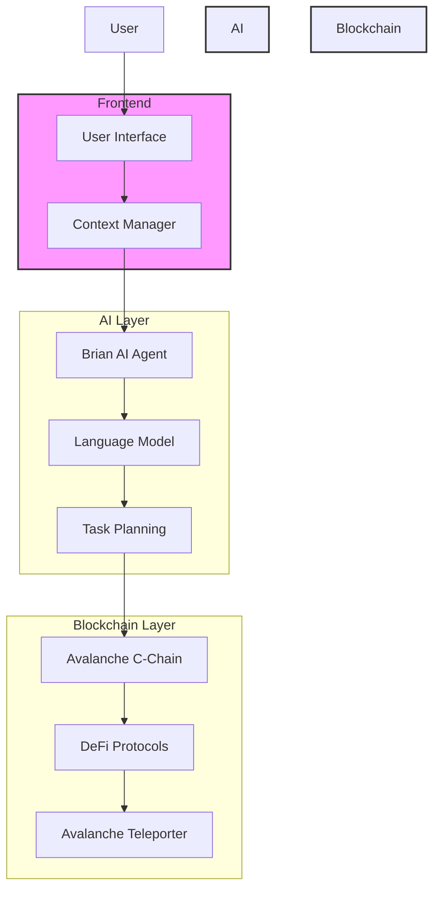
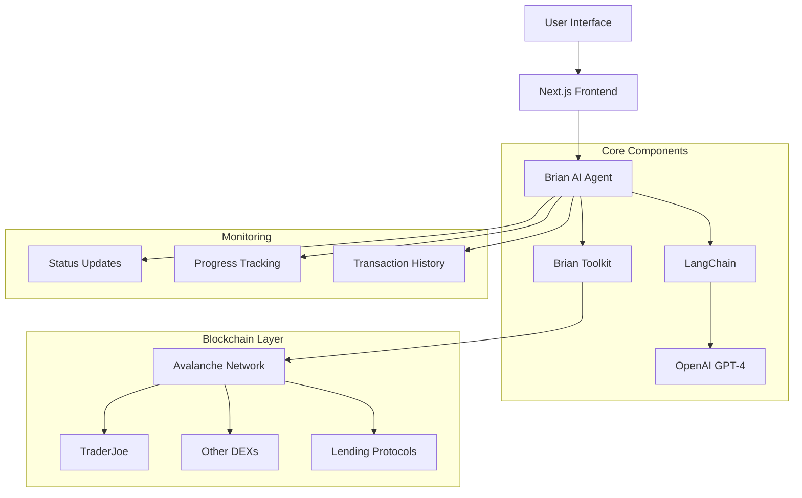

# 🤖 Avalanche Portfolio Manager AI Agent

> An autonomous AI agent for managing DeFi portfolios on Avalanche, powered by Brian AI and LangChain

- risk parameters and portfolio balance
- Provides real-time feedback and execution status

## 🎯 Problem Statement
Managing DeFi portfolios across multiple protocols on Avalanche can be complex and time-consuming. 

Users need to:
- Monitor multiple positions across different protocols
- Execute complex multi-step transactions
- Stay updated with the latest yield opportunities
- Maintain desired portfolio allocations
- React quickly to market changes

## 💡 Solution
An autonomous AI agent that manages your Avalanche DeFi portfolio by:
- Understanding high-level goals in natural language
- Breaking down complex operations into executable steps
- Automatically executing transactions when needed
- Providing real-time updates and progress tracking
- Maintaining portfolio balance according to user preferences

## 🌟 Key Features

### 1. Natural Language Interface
- Express portfolio goals in plain English
- No need to understand complex DeFi terminology
- AI translates intentions into actions

### 2. Autonomous Execution
- Breaks down complex goals into steps
- Executes transactions automatically
- Handles error recovery
- Provides progress updates

### 3. Portfolio Management
- Multi-protocol position monitoring
- Yield optimization
- Risk management
- Rebalancing capabilities

### 4. Real-time Updates
- Live execution status
- Progress tracking
- Transaction confirmations
- Performance metrics

## 🏗 Architecture



## 🛠 Technology Stack
- **Frontend**: Next.js, TypeScript, TailwindCSS
- **AI Engine**: Brian AI, LangChain, GPT-4
- **Blockchain**: Avalanche C-Chain, Teleporter
- **Development**: Foundry, Avalanche CLI

## 📋 Example Use Cases

### 1. Yield Optimization
```text
User: "Optimize my stablecoin yields while maintaining 50% USDC and 50% USDT split"

Agent will:
1. Analyze current positions
2. Scout highest yield opportunities
3. Execute necessary swaps
4. Deploy to optimal protocols
5. Monitor and rebalance as needed
```

### 2. Portfolio Rebalancing
```text
User: "Rebalance my portfolio to 30% ETH, 30% AVAX, and 40% stables"

Agent will:
1. Calculate required trades
2. Find optimal execution paths
3. Execute trades in optimal order
4. Confirm final allocations
5. Report completion
```

### 3. Cross-Chain Management
```text
User: "Bridge 1000 USDC from Ethereum to Avalanche and deploy to highest yield"

Agent will:
1. Initiate bridge transaction
2. Monitor bridge status
3. Receive funds on Avalanche
4. Research yield opportunities
5. Deploy to best protocol
```

## 🚀 Getting Started

1. Clone the repository
```bash
git clone https://github.com/kamalbuilds/ava-portfolio-manager-ai-agent
```

2. Install dependencies
```bash
cd frontend
npm install
```

3. Set up environment variables
```env
NEXT_PUBLIC_BRIAN_API_KEY=your_brian_api_key
NEXT_PUBLIC_PRIVATE_KEY=your_private_key
NEXT_PUBLIC_OPENAI_API_KEY=your_openai_api_key
```

4. Run the development server
```bash
npm run dev
```

## 📄 License
MIT

## 🤝 Contributing
Contributions are welcome! Please read our contributing guidelines before submitting PRs.
```
## ⭐ Key Features

### 🧠 Intelligent Portfolio Management
- Natural language interaction
- Autonomous strategy execution
- Real-time portfolio analysis
- Risk-aware decision making
- Multi-protocol optimization

### 💼 Portfolio Operations
- Token swaps
- Liquidity provision
- Yield farming
- Risk rebalancing
- Position management

### 📊 Monitoring & Feedback
- Real-time execution status
- Progress tracking
- Transaction confirmations
- Performance metrics
- Risk alerts

## 🏗️ Architecture



## 🛠️ Built With

- **Frontend**: Next.js, TypeScript, TailwindCSS
- **AI/ML**: Brian AI, LangChain, GPT-4
- **Blockchain**: Avalanche Network, TraderJoe DEX
- **Development**: Node.js, Ethers.js

## 📋 Prerequisites

```bash
# Required environment variables
NEXT_PUBLIC_BRIAN_API_KEY=your_brian_api_key
NEXT_PUBLIC_PRIVATE_KEY=your_private_key
NEXT_PUBLIC_OPENAI_API_KEY=your_openai_api_key
```

## 💡 Example Use Cases

### 1. Yield Optimization
```plaintext
User: "Optimize my portfolio for maximum yield while maintaining 30% in stablecoins"

Agent will:
1. Analyze current holdings
2. Identify highest yield opportunities
3. Calculate optimal allocations
4. Execute required swaps
5. Deploy capital to yield protocols
6. Maintain stability ratio
```

### 2. Risk Management
```plaintext
User: "Reduce portfolio risk and move to defensive positions"

Agent will:
1. Evaluate current risk metrics
2. Identify high-risk positions
3. Plan exit strategies
4. Execute position closures
5. Reallocate to stable assets
6. Confirm risk reduction
```

### 3. Market Opportunity
```plaintext
User: "Take advantage of AVAX price dip with 20% of portfolio"

Agent will:
1. Check current AVAX price
2. Calculate optimal entry points
3. Identify assets to swap
4. Execute DHere's a comprehensive README.md for your Avalanche Portfolio Manager AI Agent.


This starter kit will get you started with developing solidity smart contract dApps on the C-Chain or on an Avalanche L1. It provides all tools to build cross-L1 dApps using Teleporter. It includes:

- **Avalanche CLI**: Run a local Avalanche Network
- **Foundry**:
  - Forge: Compile and Deploy smart contracts to the local network, Fuji Testnet or Mainnet
  - Cast: Interact with these smart contracts
- **Teleporter**: All contracts you may want to interact with Teleporter
- **AWM Relayer**: The binary to run your own relayer
- **Examples**: Contracts showcasing how to achieve common patterns, such as sending simple messages, call functions of a contract on another blockchain and bridging assets. Please note that these example contracts have not been audited and are for educational purposes only
- **BuilderKit**: A component library providing UI elements for ICTT bridges, Cross-Chain swaps, ...

## Set Up

This starter kit utilizes a Dev Container specification. Dev Containers use containerization to create consistent and isolated development environments. All of the above mentioned components are pre-installed in that container. These containers can be run using GitHub Codespaces or locally using Docker and VS Code. You can switch back and forth between the two options.

### Run on Github Codespace

You can run them directly on Github by clicking **Code**, switching to the **Codespaces** tab and clicking **Create codespace on main**. A new window will open that loads the codespace. Afterwards you will see a browser version of VS code with all the dependencies installed. Codespace time out after some time of inactivity, but can be restarted.

### Run Dev Container locally with Docker

Alternatively, you can run them locally. You need [docker](https://www.docker.com/products/docker-desktop/) installed and [VS Code](https://code.visualstudio.com/) with the extensions [Dev Container extension](https://marketplace.visualstudio.com/items?itemName=ms-vscode-remote.remote-containers). Then clone the repository and open it in VS Code. VS Code will ask you if you want to reopen the project in a container.

## Starting a local Avalanche Network

To start a local Avalanche network with your own teleporter-enabled L1 inside the container follow these commands. Your Avalanche network will be completely independent of the Avalanche Mainnet and Fuji Testnet. It will have its own Primary Network (C-Chain, X-Chain & P-Chain). You will not have access to services available on Fuji (such as Chainlink services or bridges). If you require these, go to the [Fuji Testnet](#fuji-testnet) section.

First let's create out L1 configuration. Follow the dialog and if you don't have special requirements for precompiles just follow the suggested options. For the Airdrop of the native token select "Airdrop 1 million tokens to the default ewoq address (do not use in production)". Keep the name "mysubnet" to avoid additional configuration.

```
avalanche blockchain create myblockchain
```

Now let's spin up the local Avalanche network and deploy our L1. This will also deploy the Teleporter messenger and the registry on our L1 and the C-Chain.

```bash
avalanche blockchain deploy myblockchain
```

Make sure to add the RPC Url to the `foundry.toml` file if you have chosen a different name than `myblockchain`. If you've used `myblockchain` the rpc is already configured.

```toml
[rpc_endpoints]
local-c = "http://localhost:9650/ext/bc/C/rpc"
myblockchain = "http://localhost:9650/ext/bc/myblockchain/rpc"
anotherblockchain = "http://localhost:9650/ext/bc/BASE58_BLOCKCHAIN_ID/rpc"
```

## Code Examples

### Interchain Messaging
- [send-receive](https://academy.avax.network/course/interchain-messaging/04-icm-basics/01-icm-basics) 
- [send-roundtrip](https://academy.avax.network/course/interchain-messaging/05-two-way-communication/01-two-way-communication)
- [invoking-functions](https://academy.avax.network/course/interchain-messaging/06-invoking-functions/01-invoking-functions)
- [registry](https://academy.avax.network/course/interchain-messaging/07-icm-registry/01-icm-registry)
- [incentivized-relayer](https://academy.avax.network/course/interchain-messaging/12-incentivizing-a-relayer/01-incentivizing-a-relayer)

### Interchain Token Transfer
- [erc20-to-erc20](https://academy.avax.network/course/interchain-token-transfer/06-erc-20-to-erc-20-bridge/01-erc-20-to-erc-20-bridge) 
- [native-to-erc20](https://academy.avax.network/course/interchain-token-transfer/08-native-to-erc-20-bridge/01-native-to-erc-20-bridge)
- [native-to-native](https://academy.avax.network/course/l1-tokenomics/03-multi-chain-ecosystems/04-use-any-native-as-native-token)
- [erc20-to-native](https://academy.avax.network/course/l1-tokenomics/03-multi-chain-ecosystems/03-use-erc20-as-native-token)
- [cross-chain-token-swaps](https://academy.avax.network/course/interchain-token-transfer/13-cross-chain-token-swaps/07-exchange-contract)

### Misc
- [creating-contracts](contracts/misc/creating-contracts/REAEDME.md)
- [erc721-bridge](contracts/misc/erc721-bridge/README.md)


## Web-Apps
- [AvaCloud APIs](https://academy.avax.network/course/avacloudapis)
