# 🤖 Ava the MultiChain IP powered DeFAI Portfolio Managing AI Agents Platform

> Group of Multiple specialized autonomous AI agents with powerful tools that work together in collaberation to analyze, recommend, and execute the most optimal DeFi strategies while maintaining user-defined risk parameters and portfolio goals currently live on Flow, Hedera , Sui , Base, Avalanche , Mode , Arbitrium, powered by Story Protocol, Agent2Agent (A2A) Protocol, LangChain, and Zora Coins.


## 📑 Quick Navigation

### 🚀 Core Sections
- [Problem Statement](#-problem-statement)
- [Solution](#-solution) 
- [Demo Video](#demo-vid)
- [Architecture](#-architecture)
- [NEAR Intents User Flow](#-near-intents-user-flow)
- [Key Features](#-key-features)
- [A2A Protocol](#-a2a-protocol)
- [MCP Integration](#-mcp-integration)
- [Agent Capabilities](#-agent-capabilities)
- [Zora Coins Integration](#-zora-coins-integration)
- [Documentation](#docs)

## 🎯 Problem Statement
Managing DeFi portfolios across multiple protocols across different chains can be complex and time-consuming.

Users need to:
- Monitor multiple positions across different protocols
- Execute complex multi-step transactions
- Stay updated with the latest crosschain yield opportunities
- Maintain desired portfolio allocations
- React quickly to market changes
- Track and manage social tokens and creator coins

## 💡 Solution
An autonomous group of AI agents that manages your Multichain DeFi portfolio by:
- Understanding high-level goals in natural language
- Breaking down complex operations into executable steps
- Automatically executing transactions when needed
- Providing real-time updates and progress tracking
- Maintaining portfolio balance according to user preferences
- Creating and managing social tokens via Zora Coins

## Docs 

https://cryptoinnovators.gitbook.io/ava-the-defai-agent

## Demo Vid

https://www.youtube.com/watch?v=kYpniQ4neQk

## 🔗 NEAR Intents User Flow

### Overview
Ava leverages NEAR Protocol's Intents system to provide seamless cross-chain DeFi operations with AI-powered natural language interface. The system uses Chain Abstraction and MPC technology for gasless, cross-chain transactions.

### Complete User Interaction Flow

```mermaid
graph TD
    A[👤 User Input] -->|"Swap 100 NEAR to Bitcoin"| B[🤖 Eliza AI Agent]
    B -->|Natural Language Processing| C{Intent Recognition}
    
    C -->|Portfolio Query| D[📊 Portfolio Analysis]
    C -->|Swap Intent| E[🔄 Cross-Chain Swap]
    C -->|Stake Intent| F[🏦 Staking Operation]
    C -->|DeFi Strategy| G[💰 Yield Optimization]
    
    E --> H[🎯 NEAR Intent Creation]
    H -->|Intent Message| I[📝 Intent Serialization]
    I -->|NEP-413 Standard| J[🔐 NEAR Wallet Signing]
    
    J --> K[🌐 Solver Network]
    K -->|Best Quote| L[💱 RunesDex Solver]
    K -->|Alternative| M[🔗 Other DEX Solvers]
    
    L --> N[🔄 Cross-Chain Execution]
    N -->|MPC Signatures| O[⛓️ Bitcoin Network]
    N -->|Direct Call| P[🟢 NEAR Network]
    
    O --> Q[✅ Transaction Complete]
    P --> Q
    Q --> R[📱 Real-time Updates]
    R --> S[👤 User Notification]
    
```



### Detailed Step-by-Step Process

#### 1️⃣ **Natural Language Input**
```typescript
// User says: "I want to swap 100 NEAR to Bitcoin with the best rate"
const userInput = {
  message: "Swap 100 NEAR to Bitcoin",
  context: "portfolio_optimization",
  urgency: "normal"
};
```

#### 2️⃣ **AI Agent Processing**
```typescript
// Eliza Agent processes natural language
const intentAnalysis = await elizaAgent.processMessage({
  content: userInput.message,
  agentCapabilities: ['swap', 'portfolio', 'cross-chain'],
  supportedChains: ['near', 'bitcoin', 'ethereum']
});

// Result: Identifies cross-chain swap intent
{
  type: 'CROSS_CHAIN_SWAP',
  fromToken: { symbol: 'NEAR', amount: '100', chain: 'near' },
  toToken: { symbol: 'BTC', chain: 'bitcoin' },
  strategy: 'best_rate'
}
```

#### 3️⃣ **Intent Creation & Solver Discovery**
```typescript
// Create NEAR Intent for cross-chain swap
const swapIntent = {
  id: generateUniqueId(),
  fromToken: {
    address: 'wrap.near',
    symbol: 'NEAR',
    decimals: 24
  },
  toToken: {
    address: 'bitcoin',
    symbol: 'BTC',
    decimals: 8
  },
  amount: '100000000000000000000000000', // 100 NEAR in yoctoNEAR
  slippageTolerance: 0.01,
  deadline: Date.now() + 300000 // 5 minutes
};

// Query solver network for best quotes
const quotes = await solverNetwork.getQuotes(swapIntent);
```

#### 4️⃣ **Wallet Interaction & Signing**
```typescript
// User approves the best quote through NEAR wallet
const selectedQuote = quotes.find(q => q.rate === bestRate);

// Sign intent using NEP-413 standard
const signature = await nearWallet.signMessage({
  message: serializeIntent(swapIntent),
  receiver: 'intents.near',
  nonce: generateNonce()
});
```

#### 5️⃣ **Solver Execution**
```typescript
// RunesDex solver executes the cross-chain swap
const execution = await runesdexSolver.executeSwap({
  intent: swapIntent,
  signature: signature,
  quote: selectedQuote
});

// Solver coordinates:
// 1. NEAR → Wrapped BTC on NEAR (via Ref Finance)
// 2. Wrapped BTC → Native Bitcoin (via cross-chain bridge)
// 3. Bitcoin delivery to user's BTC address
```

#### 6️⃣ **Real-time Updates & Completion**
```typescript
// WebSocket updates keep user informed
websocket.on('transaction_update', (update) => {
  displayNotification({
    type: 'progress',
    message: `Step ${update.step}/3: ${update.description}`,
    txHash: update.transactionHash
  });
});

// Final confirmation
websocket.on('swap_complete', (result) => {
  displayNotification({
    type: 'success',
    message: `✅ Successfully swapped 100 NEAR for ${result.btcReceived} BTC`,
    explorerLink: result.explorerUrl
  });
});
```

### 🌟 Key Benefits of NEAR Intents Integration

#### **For Users**
- **Gasless Transactions**: Pay fees in any token through NEAR's meta-transactions
- **Chain Abstraction**: No need to understand different blockchain complexities
- **Natural Language**: Express complex DeFi operations in plain English
- **Optimal Routing**: Solver network finds best rates across multiple protocols
- **Single Interface**: Manage multi-chain portfolio from one dashboard

#### **For Developers**
- **Standardized Intents**: NEP-413 compliant intent messaging
- **Solver Flexibility**: Multiple execution strategies via competitive solver network
- **MPC Security**: Secure cross-chain signatures using NEAR's validator network
- **Event-Driven**: Real-time updates via WebSocket and event bus
- **Composable**: Intents can be combined for complex multi-step operations

### 🔧 Technical Implementation

#### **Chain Abstraction Architecture**
```typescript
interface ChainAbstractionLayer {
  // Generate addresses for any chain using MPC
  generateAddress(derivationPath: string): Promise<MultichainAddress>;
  
  // Sign transactions for any chain
  signTransaction(tx: Transaction, chain: string): Promise<Signature>;
  
  // Execute intents across chains
  executeIntent(intent: CrossChainIntent): Promise<ExecutionResult>;
}
```

#### **Agent Coordination**
```typescript
// Multi-agent collaboration for complex intents
const agentOrchestration = {
  elizaAgent: 'Natural language processing',
  observerAgent: 'Market analysis and risk assessment',
  executorAgent: 'Transaction execution and monitoring',
  nearAgent: 'NEAR-specific operations and ref finance',
  bitcoinAgent: 'Bitcoin network interactions'
};
```

#### **Solver Network Integration**
```typescript
// Competitive solver network
const solverNetwork = {
  runesdexSolver: 'Bitcoin ↔ NEAR swaps via RunesDex',
  refFinanceSolver: 'NEAR ecosystem DEX operations',
  crossChainSolver: 'Multi-chain bridging and swaps',
  yieldSolver: 'DeFi yield optimization strategies'
};
```

This NEAR Intents integration makes Ava the most user-friendly cross-chain DeFi platform, where users can express complex financial operations in natural language and have them executed seamlessly across multiple blockchains.

## 🏗 Architecture

### Agent-to-Agent (A2A) Protocol

Ava uses Google's A2A protocol for standardized communication between agents:

1. **Task-Based Communication**: Agents communicate by sending task requests and receiving responses
2. **Capability Discovery**: Agents discover each other's capabilities through standardized Agent Cards
3. **Multimodal Messaging**: Supports text, forms, and file exchanges between agents
4. **Secure Collaboration**: Enterprise-grade authentication and authorization


### Model Context Protocol (MCP)

MCP provides tools and resources to agents:
- Brave Search for web queries
- GitHub for repository operations
- Filesystem for file management
- And more...

### Demo on Flow

https://github.com/user-attachments/assets/2eec58f7-7a5d-414d-8aa7-672cf5fa245f


## 🌟 Key Features

1. **Natural Language Interface**
   - Express portfolio goals in plain English
   - No need to understand complex DeFi terminology
   - AI translates intentions into actions

2. **Autonomous Execution**
   - Breaks down complex goals into steps
   - Executes transactions automatically
   - Handles error recovery
   - Provides progress updates

3. **Advanced Trading & Routing**
   - Enso Finance integration for smart routing
   - CoW Protocol for MEV-protected trades
   - Gas-optimized transaction bundling
   - Cross-chain bridging via SuperchainBridge
   - Automated slippage protection

4. **Treasury Management**
   - Portfolio rebalancing across protocols
   - Yield optimization strategies
   - Risk-adjusted position management
   - Liquid staking automation
   - Cross-chain asset allocation

5. **AI-Powered Decision Making**
   - Venice.AI integration for market analysis
   - Multi-model architecture for diverse tasks
   - Real-time market sentiment analysis
   - Autonomous strategy formulation
   - Risk assessment and optimization

6. **Cross-Chain Operations**
   - SuperchainBridge for L2 transfers
   - Unified liquidity management
   - Cross-chain yield farming
   - Gas-efficient bridging operations
   - Multi-chain position monitoring

7. **Privacy & Security**
   - Lit Protocol for decentralized key management
   - Private transaction execution
   - Secure multi-party computation
   - Zero-knowledge proofs for verification
   - Encrypted agent communication

8. **Real-Time Event Communication**
   - WebSocket-based event architecture
   - Bidirectional real-time updates
   - Status tracking and monitoring
   - Autonomous mode support
   - Reliable connection management

9. **Standardized Agent Communication**
   - A2A protocol implementation for agent interoperability
   - Dynamic capability discovery between agents
   - Task delegation and coordination
   - Secure message exchange
   - Long-running task support

10. **Zora Coins Integration**
   - Create and manage Zora coins (ERC-20 tokens)
   - Track trending coins in the social token ecosystem
   - AI-powered coin recommendations based on portfolio
   - Trade creator coins directly from the portfolio manager
   - Earn referral fees through platform usage

## 🚀 Zora Coins Integration

Our platform now features full integration with Zora's Coins Protocol, allowing users to:

### For Creators
- **Create Coins**: Easily deploy new ERC-20 tokens on Base through our intuitive UI
- **Manage Payouts**: Configure payout addresses for creator earnings
- **Update Metadata**: Modify coin metadata to keep information current
- **Track Performance**: Monitor coin trading activity and earnings

### For Traders
- **Discover Coins**: Explore trending and recommended coins
- **Trade Efficiently**: Buy and sell coins with optimized slippage protection
- **Portfolio Integration**: View all your Zora coins alongside other assets
- **Performance Analytics**: Track your coin holdings' performance over time

### For Developers
- **Earn Referral Fees**: Implement the SDK and earn platform and trade referral fees
- **API Access**: Use our REST API to access Zora coin data programmatically
- **AI Integration**: Leverage our AI agents to analyze and recommend Zora coins

### Technical Implementation
- Full REST API for Zora Coins operations
- Server-side SDK integration for secure API key usage
- Seamless UI components for coin management
- Automated portfolio analysis including Zora coins

```typescript
// Example usage of our Zora Coins integration
const { getProfileBalances, getTrendingCoins } = useZoraCoins();

// Get user's coin balances
const balances = await getProfileBalances(userAddress);

// Get trending coins
const trending = await getTrendingCoins('day', 5);
```

## 🛠 Technology Stack
- **Frontend**: Next.js, TypeScript, TailwindCSS
- **AI Engine**: Brian AI, LangChain, GPT-4
- **Blockchain**: Avalanche C-Chain, Teleporter, Eigenlayer AVS, Base (for Zora Coins)
- **Development**: Foundry, Avalanche CLI
- **Indexing**: The Graph Protocol
- **Agent Communication**: Google's A2A Protocol, MCP Protocol
- **Social Media Integration**: ZerePy for Twitter interactions
- **Social Tokens**: Zora Coins SDK

## Technology Integrations

- **Multi-Agent Orchestration**
  ```typescript
  // Using A2A protocol for standardized agent communication
  const response = await a2aBus.sendTask('executor', {
    role: MessageRole.USER,
    parts: [{ text: "Execute swap of 10 ETH to USDC" }]
  });
  ```

- **Protocol-Specific Adapters**
  - Navi Protocol integration for leveraged positions
  - Bluefin interface for perpetual trading
  - Cetus integration for liquidity provision
  - Aftermath connection for DCA and staking
  - Zora Coins SDK for social token creation and management

- **User Interaction Layer**
  - Casual, friendly communication style
  - Complex strategy simplification
  - Real-time position monitoring
  - Risk alerts and notifications
  - Creator coin recommendations


### Agent Collaboration Architecture
Our multi-agent system enables complex DeFi operations through specialized agents:

```typescript
// A2A-based agent collaboration
interface AgentCollaboration {
  observer: ObserverAgent;    // Monitors positions and market conditions
  executor: ExecutorAgent;    // Handles transaction execution
  taskManager: TaskManagerAgent; // Coordinates multi-step operations
  suiAgent: SuiAgent;         // SUI-specific operations
  elizaAgent: ElizaAgent;     // User interaction and strategy explanation
  zoraAgent: ZoraAgent;       // Zora coins creation and management
}
```
