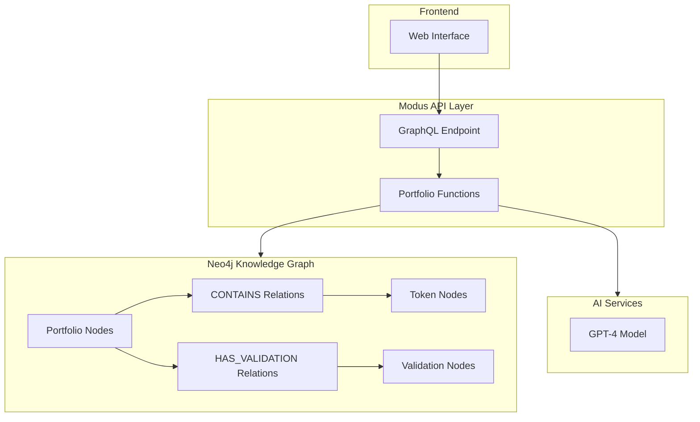

# Portfolio Validation Service with Neo4j and AI

A knowledge graph-based portfolio validation service that combines Neo4j with AI models through the Modus framework. This service enables intelligent portfolio analysis by storing portfolio data in a graph structure and using AI for validation.

## Architecture



## Features

- **Graph-Based Portfolio Storage**: Store portfolios and tokens as interconnected nodes in Neo4j
- **AI-Powered Validation**: Use GPT-4 to analyze portfolios and generate validations
- **Historical Validation Tracking**: Store all validations in the graph with timestamps
- **GraphQL API**: Easy-to-use GraphQL interface for all operations

## Getting Started

### Prerequisites

1. Install the Modus CLI:
```bash
npm i -g @hypermode/modus-cli
```

2. Install the Hyp CLI and sign in to Hypermode:
```bash
npm i -g @hypermode/hyp-cli
hyp login
```

3. Create a free [Neo4j Sandbox instance](https://sandbox.neo4j.com)

### Setup

1. Clone the repository and install dependencies:
```bash
git clone <repository-url>
cd portfolio-validation-service
npm install
```

2. Create a `.env` file with your credentials:
```env
MODUS_NEO4J_NEO4J_URI=<YOUR_NEO4J_CONNECTION_URI_HERE>
MODUS_NEO4J_USERNAME=<YOUR_NEO4J_USER_HERE>
MODUS_NEO4J_PASSWORD=<YOUR_NEO4J_PASSWORD_HERE>
MODUS_OPENAI_API_KEY=<YOUR_OPENAI_API_KEY>
```

3. Initialize the Neo4j database schema:
```bash
neo4j-admin db:import setup.cypher
```

4. Start the Modus service:
```bash
modus dev
```

The service will be available at `http://localhost:8686/graphql`

## API Usage

### Create a Portfolio

```graphql
mutation CreatePortfolio($tokens: [TokenInput!]!, $strategy: String!) {
  createPortfolio(tokens: $tokens, strategy: $strategy)
}
```

Example variables:
```json
{
  "tokens": [
    {
      "address": "0x123...",
      "symbol": "ETH",
      "amount": "1000000000000000000"
    }
  ],
  "strategy": "DeFi Yield"
}
```

### Get Portfolio Details

```graphql
query GetPortfolio($id: String!) {
  getPortfolio(id: $id)
}
```

### Validate Portfolio

```graphql
mutation ValidatePortfolio($id: String!) {
  validatePortfolio(id: $id) {
    operator
    assessment
    confidence
  }
}
```

## Knowledge Graph Schema

### Nodes
- `Portfolio`: Represents a portfolio with properties:
  - `id`: Unique identifier
  - `strategy`: Investment strategy
  - `createdAt`: Creation timestamp
  - `lastValidated`: Last validation timestamp

- `Token`: Represents a token with properties:
  - `address`: Token contract address
  - `symbol`: Token symbol

- `Validation`: Represents a validation result with properties:
  - `operator`: Type of validation check
  - `assessment`: Validation details
  - `confidence`: Confidence score
  - `timestamp`: When validation occurred

### Relationships
- `CONTAINS`: Links Portfolio to Token nodes with property:
  - `amount`: Token amount in portfolio
- `HAS_VALIDATION`: Links Portfolio to Validation nodes

## Development

### Project Structure
```
.
├── assembly/              # AssemblyScript source code
│   ├── index.ts          # Main service implementation
│   └── tsconfig.json     # AssemblyScript config
├── setup.cypher          # Neo4j schema setup
├── modus.json            # Modus configuration
├── package.json          # Project dependencies
└── README.md            # This file
```

### Key Technologies
- **Neo4j**: Graph database for storing portfolio data
- **Modus Framework**: API framework for connecting Neo4j with AI models
- **GPT-4**: AI model for portfolio analysis
- **AssemblyScript**: Type-safe implementation language
- **GraphQL**: API query language

## Contributing

1. Fork the repository
2. Create a feature branch
3. Commit your changes
4. Push to the branch
5. Create a Pull Request

## License

This project is licensed under the MIT License - see the LICENSE file for details.