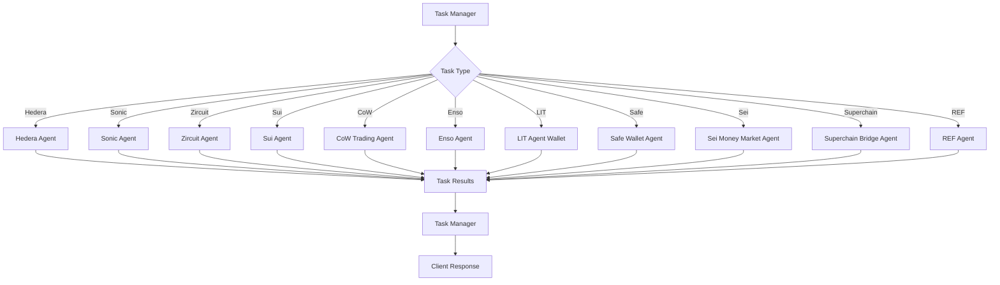

# Specialized Agents

This document provides comprehensive documentation for all the specialized agents in the Ava Portfolio Manager system. These agents provide specific functionality for different blockchain networks, protocols, and use cases.

## Overview

The Ava Portfolio Manager system includes several specialized agents that handle specific blockchain networks, protocols, and DeFi operations. Each agent is designed to integrate seamlessly with the overall system while providing deep expertise in their respective domains.

## Chain-Specific Agents

### Hedera Agent

The Hedera Agent provides comprehensive integration with the Hedera Hashgraph network, supporting native token operations, consensus service interactions, and smart contract deployments.

#### Key Features
- **Native Token Support**: Full HBAR balance management and transfers
- **Fungible Token Service**: Create and manage HTS tokens
- **Consensus Service**: Topic creation and message submission
- **Smart Contract Integration**: Deploy and interact with smart contracts
- **Account Management**: Multi-account support with secure key management

#### Architecture
```typescript
interface HederaAgent {
  // Core Hedera Kit integration
  hederaKit: HederaAgentKit;
  
  // Configuration
  config: {
    accountId: string;
    privateKey: string;
    network: 'mainnet' | 'testnet' | 'previewnet';
  };
  
  // Operations
  operations: {
    createFungibleToken: (options: FTOptions) => Promise<TokenId>;
    transferToken: (tokenId: string, toAccountId: string, amount: number) => Promise<TransactionResult>;
    getHbarBalance: (accountId?: string) => Promise<number>;
    createTopic: (topicMemo: string, isSubmitKey?: boolean) => Promise<TopicId>;
    submitTopicMessage: (topicId: string, message: string) => Promise<TransactionResult>;
  };
}
```

#### Usage Examples
```typescript
// Balance query
eventBus.emit('task-manager-hedera', {
  taskId: 'hbar-balance-001',
  task: 'Get HBAR balance for account 0.0.123456'
});

// Token creation
eventBus.emit('task-manager-hedera', {
  taskId: 'create-token-001',
  task: JSON.stringify({
    operation: 'createFungibleToken',
    params: {
      name: 'MyToken',
      symbol: 'MTK',
      decimals: 8,
      initialSupply: 1000000
    }
  })
});
```

### Sonic Agent

The Sonic Agent provides integration with the Sonic blockchain, focusing on high-performance DeFi operations and market-making strategies.

#### Key Features
- **Sonic Market Integration**: Direct integration with Sonic's native DEX
- **High-Speed Trading**: Optimized for low-latency trading operations
- **MarginZero Protocol**: Advanced options trading capabilities
- **Liquidity Management**: Automated liquidity provision and management
- **Cross-Chain Bridge**: Seamless asset transfers to/from Sonic

#### Architecture
```typescript
interface SonicAgent {
  // Market integration
  sonicProvider: SonicMarketProvider;
  marginZeroProvider?: MarginZeroProvider;
  
  // Configuration
  config: {
    chainId: CHAIN_IDS;
    rpcUrl: string;
    account: Account;
  };
  
  // Operations
  operations: {
    getMarketData: () => Promise<MarketData>;
    executeTrade: (params: TradeParams) => Promise<TradeResult>;
    manageLiquidity: (params: LiquidityParams) => Promise<LiquidityResult>;
    bridgeAssets: (params: BridgeParams) => Promise<BridgeResult>;
  };
}
```

### Zircuit Agent

The Zircuit Agent provides integration with the Zircuit L2 network, focusing on privacy-preserving DeFi operations.

#### Key Features
- **Privacy-First Operations**: Zero-knowledge proof integration
- **L2 Optimization**: Gas-efficient transaction batching
- **Cross-Layer Bridge**: Seamless L1/L2 asset transfers
- **Privacy Pools**: Anonymous liquidity provision
- **Compliance Features**: Built-in compliance and reporting tools

#### Architecture
```typescript
interface ZircuitAgent {
  // Network integration
  account: Account;
  aiProvider?: AIProvider;
  
  // Privacy features
  zkProofSystem: ZKProofSystem;
  privacyPool: PrivacyPool;
  
  // Operations
  operations: {
    executePrivateTrade: (params: PrivateTradeParams) => Promise<TradeResult>;
    bridgeToL2: (params: BridgeParams) => Promise<BridgeResult>;
    generateZKProof: (params: ProofParams) => Promise<ZKProof>;
    joinPrivacyPool: (params: PoolParams) => Promise<PoolResult>;
  };
}
```

### Sui Agent

The Sui Agent provides comprehensive integration with the Sui blockchain, supporting Move-based smart contracts and parallel execution.

#### Key Features
- **Move Language Support**: Native Move smart contract interaction
- **Parallel Execution**: Multi-threaded transaction processing
- **Object-Oriented Model**: Sui's unique object ownership model
- **DeFi Protocol Integration**: Support for major Sui DeFi protocols
- **NFT Management**: Comprehensive NFT operations

#### Architecture
```typescript
interface SuiAgent {
  // Sui SDK integration
  suiClient: SuiClient;
  
  // Protocol integrations
  protocols: {
    cetus: CetusProtocol;
    navi: NaviProtocol;
    aftermath: AftermathProtocol;
    bluefin: BluefinProtocol;
  };
  
  // Operations
  operations: {
    executeMove: (params: MoveParams) => Promise<MoveResult>;
    swapTokens: (params: SwapParams) => Promise<SwapResult>;
    provideLiquidity: (params: LiquidityParams) => Promise<LiquidityResult>;
    managePerpetuals: (params: PerpParams) => Promise<PerpResult>;
  };
}
```

## Protocol-Specific Agents

### CoW Trading Agent

The CoW Trading Agent integrates with CoW Protocol to provide MEV-protected trading with batch auctions and gasless transactions.

#### Key Features
- **MEV Protection**: Protection against front-running and sandwich attacks
- **Batch Auctions**: Efficient batch settlement for better prices
- **Gasless Trading**: Meta-transactions with gasless execution
- **Coincidence of Wants**: Automatic order matching for better prices
- **Surplus Redistribution**: Fair surplus distribution to traders

#### Architecture
```typescript
interface CoWTradingAgent {
  // CoW Protocol integration
  cowProtocol: CoWProtocol;
  
  // Order management
  orderManager: OrderManager;
  
  // Operations
  operations: {
    createOrder: (params: OrderParams) => Promise<OrderResult>;
    batchSettle: (orders: Order[]) => Promise<SettlementResult>;
    calculateSurplus: (order: Order) => Promise<SurplusResult>;
    executeGaslessSwap: (params: SwapParams) => Promise<SwapResult>;
  };
}
```

### Enso Agent

The Enso Agent provides integration with Enso Finance for cross-protocol DeFi operations and yield optimization.

#### Key Features
- **Cross-Protocol Integration**: Unified interface for multiple DeFi protocols
- **Yield Optimization**: Automated yield farming strategies
- **Strategy Management**: Dynamic strategy adjustment based on market conditions
- **Risk Management**: Comprehensive risk assessment and mitigation
- **Portfolio Rebalancing**: Automated portfolio optimization

#### Architecture
```typescript
interface EnsoAgent {
  // Enso Finance integration
  ensoFinance: EnsoFinance;
  
  // Strategy management
  strategyManager: StrategyManager;
  
  // Operations
  operations: {
    executeStrategy: (params: StrategyParams) => Promise<StrategyResult>;
    optimizeYield: (params: YieldParams) => Promise<YieldResult>;
    rebalancePortfolio: (params: RebalanceParams) => Promise<RebalanceResult>;
    assessRisk: (params: RiskParams) => Promise<RiskResult>;
  };
}
```

### LIT Agent Wallet

The LIT Agent Wallet provides decentralized key management and programmable signing using LIT Protocol.

#### Key Features
- **Decentralized Key Management**: Distributed key generation and management
- **Programmable Signing**: Conditional transaction signing based on custom logic
- **Multi-Chain Support**: Cross-chain key management and signing
- **Threshold Signatures**: Multi-party signature schemes
- **Access Control**: Fine-grained access control for wallet operations

#### Architecture
```typescript
interface LITAgentWallet {
  // LIT Protocol integration
  litProtocol: LITProtocol;
  
  // Key management
  keyManager: KeyManager;
  
  // Operations
  operations: {
    generateKeys: (params: KeyGenParams) => Promise<KeyResult>;
    signTransaction: (params: SignParams) => Promise<SignResult>;
    setAccessControl: (params: AccessParams) => Promise<AccessResult>;
    executeConditionalSign: (params: ConditionalParams) => Promise<SignResult>;
  };
}
```

### Safe Wallet Agent

The Safe Wallet Agent provides integration with Safe (formerly Gnosis Safe) for multi-signature wallet operations.

#### Key Features
- **Multi-Signature Support**: Configurable multi-sig wallet operations
- **Transaction Batching**: Batch multiple transactions for efficiency
- **Proposal System**: Democratic transaction proposal and approval
- **Module System**: Extensible functionality through Safe modules
- **Recovery Mechanisms**: Social recovery and guardian systems

#### Architecture
```typescript
interface SafeWalletAgent {
  // Safe integration
  safeSDK: SafeSDK;
  
  // Multi-sig management
  multiSigManager: MultiSigManager;
  
  // Operations
  operations: {
    createSafe: (params: SafeParams) => Promise<SafeResult>;
    proposeTransaction: (params: ProposalParams) => Promise<ProposalResult>;
    executeTransaction: (params: ExecuteParams) => Promise<ExecuteResult>;
    addOwner: (params: OwnerParams) => Promise<OwnerResult>;
  };
}
```

### Sei Money Market Agent

The Sei Money Market Agent provides integration with Sei's money market protocols for lending and borrowing operations.

#### Key Features
- **Lending Operations**: Automated lending strategy optimization
- **Borrowing Management**: Intelligent borrowing with collateral management
- **Liquidation Protection**: Proactive liquidation risk management
- **Yield Optimization**: Cross-protocol yield optimization
- **Risk Assessment**: Real-time risk monitoring and alerts

#### Architecture
```typescript
interface SeiMoneyMarketAgent {
  // Sei blockchain integration
  seiClient: SeiClient;
  
  // Money market protocols
  moneyMarkets: MoneyMarketProtocol[];
  
  // Operations
  operations: {
    lendAssets: (params: LendParams) => Promise<LendResult>;
    borrowAssets: (params: BorrowParams) => Promise<BorrowResult>;
    repayLoan: (params: RepayParams) => Promise<RepayResult>;
    liquidatePosition: (params: LiquidateParams) => Promise<LiquidateResult>;
  };
}
```

### Superchain Bridge Agent

The Superchain Bridge Agent provides seamless asset transfers across the Optimism Superchain ecosystem.

#### Key Features
- **Cross-Chain Transfers**: Efficient asset bridging between Superchain networks
- **Optimistic Rollup Support**: Native support for Optimism and its ecosystem
- **Batch Processing**: Efficient batch processing for multiple transfers
- **Fee Optimization**: Intelligent fee optimization across chains
- **Security Features**: Enhanced security with fraud proof integration

#### Architecture
```typescript
interface SuperchainBridgeAgent {
  // Superchain integration
  superchainSDK: SuperchainSDK;
  
  // Bridge management
  bridgeManager: BridgeManager;
  
  // Operations
  operations: {
    bridgeAssets: (params: BridgeParams) => Promise<BridgeResult>;
    batchTransfer: (params: BatchParams) => Promise<BatchResult>;
    optimizeFees: (params: FeeParams) => Promise<FeeResult>;
    validateTransfer: (params: ValidateParams) => Promise<ValidateResult>;
  };
}
```

## Utility Agents

### Task Manager Agent

The Task Manager Agent serves as the central coordinator for all agent operations, managing task distribution and execution flow.

#### Key Features
- **Task Orchestration**: Intelligent task routing and coordination
- **Load Balancing**: Efficient task distribution across agents
- **Dependency Management**: Task dependency resolution and execution ordering
- **Error Handling**: Comprehensive error handling and recovery
- **Performance Monitoring**: Real-time performance tracking and optimization

#### Architecture
```typescript
interface TaskManagerAgent {
  // Task management
  taskQueue: TaskQueue;
  taskExecutor: TaskExecutor;
  
  // Agent coordination
  agentRegistry: AgentRegistry;
  
  // Operations
  operations: {
    distributeTask: (task: Task) => Promise<TaskResult>;
    coordinateExecution: (tasks: Task[]) => Promise<ExecutionResult>;
    handleDependencies: (tasks: Task[]) => Promise<DependencyResult>;
    monitorPerformance: () => Promise<PerformanceMetrics>;
  };
}
```

### REF Agent

The REF Agent provides integration with REF Finance on NEAR Protocol for AMM operations and yield farming.

#### Key Features
- **NEAR Protocol Integration**: Native NEAR blockchain support
- **AMM Operations**: Automated market making and liquidity provision
- **Yield Farming**: Optimized yield farming strategies
- **Cross-Chain Bridge**: NEAR Rainbow Bridge integration
- **Staking Operations**: NEAR staking and delegation

#### Architecture
```typescript
interface REFAgent {
  // NEAR integration
  nearClient: NearClient;
  
  // REF Finance integration
  refFinance: REFFinance;
  
  // Operations
  operations: {
    swapTokens: (params: SwapParams) => Promise<SwapResult>;
    provideLiquidity: (params: LiquidityParams) => Promise<LiquidityResult>;
    farmYield: (params: FarmParams) => Promise<FarmResult>;
    bridgeAssets: (params: BridgeParams) => Promise<BridgeResult>;
  };
}
```

## Event System Integration

### Inter-Agent Communication

All specialized agents integrate with the central event bus for seamless communication:

```typescript
interface EventBusIntegration {
  // Incoming events
  incomingEvents: {
    [`task-manager-${agentName}`]: (data: TaskData) => Promise<void>;
    [`${agentName}-update`]: (data: UpdateData) => Promise<void>;
  };
  
  // Outgoing events
  outgoingEvents: {
    [`${agentName}-task-manager`]: (data: ResultData) => void;
    [`${agentName}-error`]: (data: ErrorData) => void;
  };
}
```

### Event Flow Architecture



## Configuration Management

### Environment Variables

Each agent requires specific configuration parameters:

```typescript
interface AgentConfigurations {
  // Hedera Agent
  HEDERA_ACCOUNT_ID: string;
  HEDERA_PRIVATE_KEY: string;
  HEDERA_NETWORK: 'mainnet' | 'testnet' | 'previewnet';
  
  // Sonic Agent
  SONIC_CHAIN_ID: string;
  SONIC_RPC_URL: string;
  MARGIN_ZERO_POSITION_MANAGER_ADDRESS: string;
  MARGIN_ZERO_OPTION_MARKET_ADDRESS: string;
  
  // Zircuit Agent
  ZIRCUIT_RPC_URL: string;
  ZIRCUIT_PRIVATE_KEY: string;
  
  // Sui Agent
  SUI_RPC_URL: string;
  SUI_PRIVATE_KEY: string;
  
  // CoW Trading Agent
  COW_PROTOCOL_API_URL: string;
  COW_PROTOCOL_CHAIN_ID: string;
  
  // Enso Agent
  ENSO_API_KEY: string;
  ENSO_API_URL: string;
  
  // LIT Agent Wallet
  LIT_PROTOCOL_NETWORK: string;
  LIT_PROTOCOL_CHAIN: string;
  
  // Safe Wallet Agent
  SAFE_SERVICE_URL: string;
  SAFE_WALLET_ADDRESS: string;
  
  // Sei Money Market Agent
  SEI_RPC_URL: string;
  SEI_PRIVATE_KEY: string;
  
  // Superchain Bridge Agent
  OPTIMISM_RPC_URL: string;
  BASE_RPC_URL: string;
  
  // REF Agent
  NEAR_RPC_URL: string;
  NEAR_PRIVATE_KEY: string;
}
```

## Error Handling and Recovery

### Common Error Patterns

All agents implement standardized error handling:

```typescript
interface AgentError {
  agent: string;
  taskId: string;
  error: {
    code: string;
    message: string;
    details?: any;
  };
  timestamp: number;
  recoverable: boolean;
}

// Error types
enum AgentErrorType {
  NETWORK_ERROR = 'NETWORK_ERROR',
  INSUFFICIENT_BALANCE = 'INSUFFICIENT_BALANCE',
  INVALID_PARAMETERS = 'INVALID_PARAMETERS',
  PROTOCOL_ERROR = 'PROTOCOL_ERROR',
  TIMEOUT_ERROR = 'TIMEOUT_ERROR'
}
```

### Recovery Mechanisms

- **Automatic Retry**: Configurable retry logic with exponential backoff
- **Fallback Providers**: Alternative RPC providers for network resilience
- **Graceful Degradation**: Reduced functionality during partial failures
- **State Recovery**: Automatic state recovery after system restarts

## Performance Optimization

### Caching Strategies

- **Network State Caching**: Cache blockchain state for reduced RPC calls
- **Protocol Data Caching**: Cache protocol-specific data for faster access
- **Configuration Caching**: Cache agent configurations for quick startup
- **Result Caching**: Cache computation results for repeated queries

### Connection Management

- **Connection Pooling**: Efficient connection management for RPC providers
- **Load Balancing**: Distribute requests across multiple providers
- **Circuit Breakers**: Prevent cascade failures with circuit breaker patterns
- **Health Monitoring**: Continuous health monitoring of external services

## Future Enhancements

### Planned Features

- **Advanced AI Integration**: Enhanced AI-powered task interpretation
- **Cross-Chain Coordination**: Advanced cross-chain operation coordination
- **Performance Analytics**: Comprehensive performance tracking and optimization
- **Custom Agent Framework**: Framework for creating custom specialized agents
- **Enhanced Security**: Advanced security features and audit capabilities

### Integration Roadmap

- **New Chain Support**: Support for additional blockchain networks
- **Protocol Expansions**: Integration with new DeFi protocols
- **Advanced Strategies**: Implementation of advanced trading and yield strategies
- **Enterprise Features**: Enterprise-grade features for institutional use
- **Compliance Tools**: Enhanced compliance and regulatory reporting tools

## Best Practices

### Agent Development

1. **Modular Design**: Keep agents focused on specific domains
2. **Error Resilience**: Implement comprehensive error handling
3. **Performance Optimization**: Optimize for specific use cases
4. **Security First**: Prioritize security in all operations
5. **Monitoring Integration**: Include comprehensive monitoring and logging

### Integration Guidelines

1. **Event-Driven Architecture**: Use event bus for all communications
2. **Standardized Interfaces**: Implement consistent interfaces across agents
3. **Configuration Management**: Use environment variables for configuration
4. **Testing Strategy**: Implement comprehensive testing strategies
5. **Documentation**: Maintain comprehensive documentation for all agents

This comprehensive documentation provides a complete overview of all specialized agents in the Ava Portfolio Manager system, their capabilities, architectures, and integration patterns. 